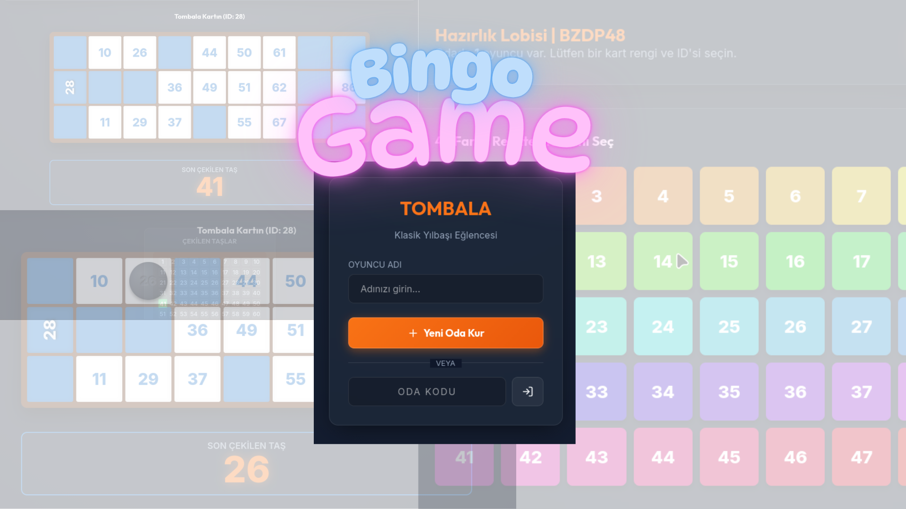

# 🎲 Modern Multiplayer Tombala (Bingo)

* [🇹🇷 Türkçe İçerik İçin Tıklayın](#türkçe)
* [🇬🇧 Click for English Content](#english)

---

<h2 id="türkçe">🇹🇷 TÜRKÇE</h2>



Geleneksel yılbaşı eğlencesi Tombala'nın, React.js ve Node.js (Socket.io) tabanlı modern, gerçek zamanlı ve rekabetçi çok oyunculu (multiplayer) web versiyonu. Bu proje klasik kurallara tamamen sadık kalırken, dijitalin getirdiği interaktif hızla yepyeni bir "İlk tıklayan kapar" rekabeti sunar.

### ✨ Öne Çıkan Özellikler

- **🏠 Gerçek Zamanlı Odalar:** Özel 6 haneli oda kodu ile arkadaşlarınızı davet edebilir, "Host" (Kurucu) olarak oyunu dilediğiniz zaman başlatabilirsiniz.
- **🎨 48 Özel Renkli Kart Seti:** Lobi ekranında 48 farklı renkten oluşan (matematiksel HSL kartları) bir grid üzerinden dilediğiniz kart numarasını ve rengini kimse kapmadan seçin. Kartlar klasik yan (sideways) ID tasarımlarına sahiptir.
- **⚡ Akıllı Çinko & Tombala Hakemi:** Oyuncular kartlarındaki çıkan sayının üzerine tıklayarak, içe göçük/kabartmalı siyah oyun pullarını koyarlar. Sayıyı fiziksel olarak işaretlemediğiniz sürece sistem size Çinko vermez.
- **🥇 İlk Tıklayan Kapar Rekabeti:** Tombalada eğer bir satırın son numarası birden fazla oyuncuda varsa, sayıyı duyduğu an kendi ekranında ona **ilk basan** Çinkoyu garantiler!
- **🚨 Canlı Uyarı ve Duyuru Sistemi:** Çıkmayan numaraya pul koymaya kalktığınızda kırmızı hata uyarısı alırsınız. Her başarılı Çinko/Tombala yeşil neon mesajlarla bütün odaya duyurulur.
- **💎 Glassmorphism Arayüz:** Neon glow parıltıları, yarı saydam cam panelleri ve akıcı css animasyonlarıyla son derece "premium" bir oyun ekranı (Responsive uyumlu).

### 🛠️ Kullanılan Teknolojiler

**Frontend (Kullanıcı Arayüzü):**
- [React](https://reactjs.org/) (Vite ile)
- Vanilla CSS, CSS Grid, Custom Properties tabanlı dinamik kart algoritması
- Lucide React (İkonlar)

**Backend (Sunucu ve Oyun Motoru):**
- [Node.js](https://nodejs.org/) & [Express](https://expressjs.com/)
- [Socket.io](https://socket.io/) (Çift yönlü canlı websocket iletişimi)

### 🚀 Kurulum & Çalıştırma (Lokalde Test Etmek İçin)

Proje `backend` ve `frontend` olmak üzere iki ayrı servis içerir. Repoyu indirdikten sonra her biri için bir terminal açın.

**1. Backend (Sunucu) Kurulumu**
```bash
cd backend
npm install
node server.js
```
> *Sunucu `http://localhost:3001` adresinde dinlemeye başlayacaktır.*

**2. Frontend (Kullanıcı Arayüzü) Kurulumu**
```bash
cd frontend
npm install
npm run dev
```
> *Tarayıcınızda `http://localhost:5175` adresinden uygulamaya erişebilirsiniz.*

### 📄 Oyun Kuralları
1. "Yeni Oda Kur" diyerek lobi açın ve oda kodunu arkadaşlarınıza yollayın. Davetliler "Odaya Katıl" butonu ile dâhil olsun.
2. 48 farklı karttan şanslı kartınızı seçip tıklayın.
3. Herkes hazır olduğunda Host oyunu başlatır.
4. Çekilen sayı kartınızda varsa hızla üzerine tıklayıp **siyah pulu** basın. Aksi halde çinkonuz sayılmaz!
5. 3 satırı ilk bitiren Tombalayı kazanır!

---

<h2 id="english">🇬🇧 ENGLISH</h2>


A modern, real-time, and competitive multiplayer web version of the traditional New Year's Eve game Tombala (Bingo), built with React.js and Node.js (Socket.io). While strictly adhering to classic rules, this project introduces a brand new "First to Click Wins" mechanic brought by digital interactive speed.

### ✨ Key Features

- **🏠 Real-Time Rooms:** Invite friends using a unique 6-digit room code, and start the game whenever you want as the "Host".
- **🎨 48 Custom Colored Cards Set:** Select your lucky card number and color before anyone else from a 48-slot grid of dynamic (HSL) cards in the lobby. Cards feature classic sideways vertical ID designs.
- **⚡ Smart Bingo Referee:** Players physically place embossed black marker tokens by clicking on drawn numbers. The system won't grant a line win (Çinko) unless you physically mark your numbers!
- **🥇 The "First to Click" Competition:** If the final number of a line belongs to multiple players simultaneously, the first player to hear the number and click it on their screen secures the win!
- **🚨 Live Alert & Announcement System:** Receive a red error warning if you attempt to mark an undrawn number. Every successful win is broadcasted to the entire room via green neon announcements.
- **💎 Glassmorphism Interface:** A highly "premium" game screen featuring neon glows, translucent glass panels, and smooth CSS animations (Fully responsive).

### 🛠️ Tech Stack

**Frontend:**
- [React](https://reactjs.org/) (Created with Vite)
- Vanilla CSS, CSS Grid, Custom Properties based dynamic card algorithm
- Lucide React (Vector Icons)

**Backend:**
- [Node.js](https://nodejs.org/) & [Express](https://expressjs.com/)
- [Socket.io](https://socket.io/) (Bi-directional live communication)

### 🚀 Installation & Running (Local Environment)

The repository contains two separate services: `backend` and `frontend`. Open two different terminals after cloning.

**1. Backend Server Setup**
```bash
cd backend
npm install
node server.js
```
> *The server will start listening on `http://localhost:3001`.*

**2. Frontend Setup**
```bash
cd frontend
npm install
npm run dev
```
> *Access the application in your browser at `http://localhost:5175`.*

### 📄 How to Play
1. Create a lobby by clicking "Yeni Oda Kur" (Create Room) and share the 6-digit code. Guests join via "Odaya Katıl" (Join Room).
2. Choose and lock your lucky card from the 48-card showcase.
3. Once everyone validates their card, the Host starts the game.
4. When a number gets drawn, you must actively click matching numbers on your card to place a **black marker token**. Failure to do so prevents you from winning!
5. The first player to complete all 3 lines wins the Tombala!
